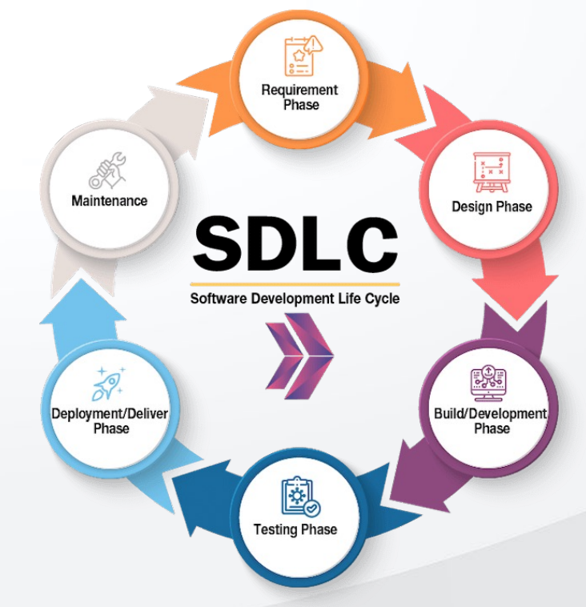

# 🔄 Software Development Life Cycle (SDLC)

**SDLC** stands for **Software Development Life Cycle**. It is a structured process followed by the software industry to **design, develop, and test** high-quality software.

---

## 📌 Purpose

The main goal of SDLC is to produce software that:
- Meets customer expectations
- Is completed within time and budget
- Is reliable and maintainable

---

## 🛠️ Common SDLC Phases

1. **Requirement Analysis** – Understand what needs to be built  
2. **Planning** – Define scope, resources, and timelines  
3. **Design** – Architect the software solution  
4. **Development** – Write the actual code  
5. **Testing** – Ensure the product is bug-free and meets requirements  
6. **Deployment** – Release the product to users  
7. **Maintenance** – Ongoing support and updates

---

> ✅ SDLC helps teams deliver quality software in a systematic and efficient manner.

# SDLC
 