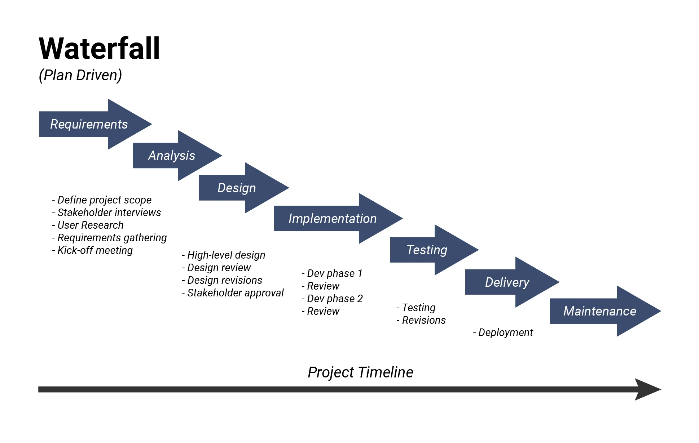

# 💧 Waterfall Model – The Primitive SDLC Approach

The **Waterfall Model** is a traditional software development methodology that follows a **linear, phase-by-phase process**. It is best suited for small projects with clearly defined requirements.

---

## 📊 Advantages vs. Disadvantages

| ✅ Advantages                                 | ❌ Disadvantages                                               |
|----------------------------------------------|----------------------------------------------------------------|
| High product quality                          | Requirement changes are not allowed                            |
| Low bug probability due to fixed requirements | Requirement defects affect later phases                        |
| Lower initial investment (late testing phase) | High total investment due to rework                            |
| Suitable for small, well-defined projects     | Testing starts only after development, causing late bug fixes  |

---

> 📌 Use the Waterfall model when requirements are fixed and the project scope is small.

---
---
# Waterfall model 

---

## ✅ Advantages of Waterfall Model

- ✔️ **High Product Quality**  
  Due to structured and well-defined phases.

- ✔️ **Low Bug Probability**  
  Since requirement changes are not allowed, fewer bugs are introduced.

- ✔️ **Lower Initial Investment**  
  Testers are hired in later stages, reducing early costs.

- ✔️ **Ideal for Small Projects**  
  Especially when requirements are clearly defined and frozen.

---

## ❌ Disadvantages of Waterfall Model

- ❗ **No Requirement Flexibility**  
  Changes in requirements are not allowed once the project starts.

- ❗ **Requirement Defects Propagate**  
  Errors in the early phase (like requirements) carry over to later stages.

- ❗ **High Total Investment**  
  Rework is expensive and time-consuming due to late testing.

- ❗ **Late Testing**  
  Testing begins only after development is complete, which delays defect detection.

---

> 📌 Best suited for small, well-defined projects with stable requirements.