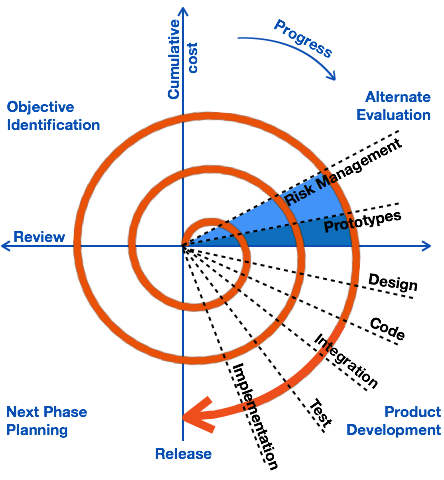

# 🔁 Spiral Model – Iterative SDLC Model

The **Spiral Model** is an **iterative software development model** that combines elements of both design and prototyping. It addresses the limitations of the Waterfall model and is suitable for projects with module dependencies.

---

## 🔄 Key Features

- Each cycle produces a **new version** of the software.
- **Customer feedback** is incorporated after every cycle.
- Known as a **version control model** due to multiple software releases.
- Follows a **repetitive development process** where software evolves over time.

---

## 📊 Advantages vs. Disadvantages

| ✅ Advantages                                                | ❌ Disadvantages                                                |
|-------------------------------------------------------------|----------------------------------------------------------------|
| Testing is done at the end of every cycle                   | Requirement changes are not allowed within a cycle             |
| Customer uses and gives feedback after each module release  | Each cycle behaves like a mini-Waterfall model                 |
| Requirements can change after completing a cycle            | No testing is done in the requirement & design phases          |

---

> 📌 Spiral Model is ideal for large, complex projects with evolving requirements and module dependencies.

# Spiral model 
 