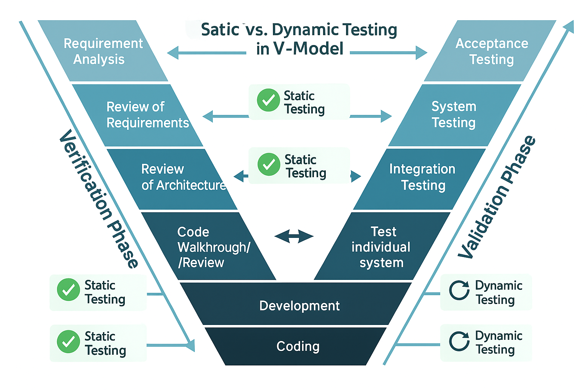

# ✅ V-Model in SDLC (Verification and Validation Model)

The **V-Model** (Validation and Verification Model) is an SDLC model that emphasizes a **testing phase corresponding to each development stage**. It ensures quality by involving **early testing and reviews**, forming a "V" shape.

---

## 📌 What is V-Model?

- Extension of the Waterfall model.
- Testing is planned in parallel with development.
- Each development phase has a matching testing phase.
- Suitable for small to medium projects with clear requirements.

---

## 🔍 Verification vs. Validation

| Verification                                  | Validation                                     |
|----------------------------------------------|------------------------------------------------|
| Are we building the **right product**?        | Are we building the product **right**?         |
| Focuses on **documentation & planning**       | Focuses on the **actual software**             |
| Done via:                                     | Done via:                                      |
| - Reviews                                     | - Unit Testing                                 |
| - Walkthroughs                                | - Integration Testing                          |
| - Inspections                                 | - System Testing                               |
|                                               | - User Acceptance Testing (UAT)                |
| Performed **before coding**                   | Performed **after coding**                     |

---

## 🧩 Static vs. Dynamic Testing in V-Model

| Phase                          | Activity                  | Type of Testing     |
|-------------------------------|---------------------------|---------------------|
| Requirement Analysis          | Review of Requirements    | ✅ Static Testing    |
| System Design                 | Review of Architecture    | ✅ Static Testing    |
| High-Level Design             | Design Review             | ✅ Static Testing    |
| Low-Level Design              | Code Walkthrough/Review   | ✅ Static Testing    |
| Coding                        | Development                | –                   |
| Unit Testing                  | Test individual modules    | 🔁 Dynamic Testing   |
| Integration Testing           | Test module interactions   | 🔁 Dynamic Testing   |
| System Testing                | Test complete system       | 🔁 Dynamic Testing   |
| Acceptance Testing            | User-based validation      | 🔁 Dynamic Testing   |

---

## ✅ Advantages of V-Model

- Testing is involved in **each and every phase**.
- Defects can be found early.
- Clear structure and easier to manage.
- High focus on **verification and validation**.

---

## ❌ Disadvantages of V-Model

- **No flexibility** to handle changing requirements.
- No early working software.
- **Documentation is more**.
- **Initial investment is higher** due to early testing and planning efforts.

---

> 🔎 **As a tester**, your responsibilities include:
> - **Static Testing** (early phase): Reviews, walkthroughs, inspections.
> - **Dynamic Testing** (later phase): Executing unit, integration, system, and UAT tests.

---
 
 

# V-Model(VV-Model-> varification and validation)
