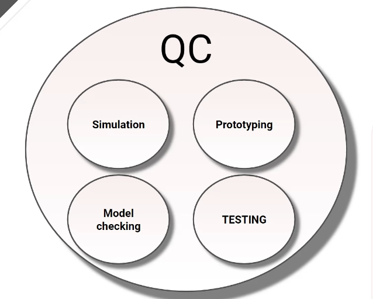
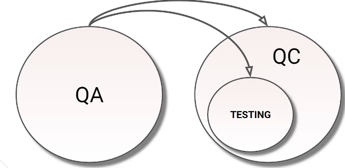

## 1.7 Quality Assurance (QA) vs. Quality Control (QC) & Testing 📈

**Quality Management** ensures an organization consistently delivers quality. It achieves this through two key functions: **Quality Assurance (QA)** and **Quality Control (QC)**.

## Understanding Testing, QA, and QC ⚙️

In software development, **Testing**, **Quality Assurance (QA)**, and **Quality Control (QC)** are all essential for delivering a great product. They work together under the umbrella of **Quality Management**.

---
| Aspect                       | Quality Assurance (QA)                        | Quality Control (QC)                          |
|-----------------------------|-----------------------------------------------|-----------------------------------------------|
| Definition                  | Process-related activities ensuring quality   | Actual testing to verify product quality      |
| Focus                       | Building in quality                           | Testing for quality                           |
| Objective                   | Preventing defects                            | Detecting defects                             |
| Orientation                 | Process-oriented                              | Product-oriented                              |
| Timing                      | Involved throughout the SDLC                  | Involved during the testing phase             |
| Nature                      | Proactive                                     | Reactive                                       |
| Activities                  | Process audits, documentation reviews         | Functional testing, regression testing, etc.  |
| Responsibility              | Everyone involved in development              | Primarily testers and QA engineers            |
| Output                      | Improved development process                  | Verified working product                      |
| Goal                        | To improve and stabilize processes            | To ensure the product meets requirements      |

---

### 1. Quality Assurance (QA): The Architects 🏗️ (Prevention)

QA is a **proactive** process focused on **preventing** defects by creating and improving the systems and procedures used to build the product.

* **Focus**: Processes, standards, and guidelines.
* **Goal**: To stop bugs from ever being created.
* **Analogy**: Designing the perfect recipe and setting up the kitchen correctly *before* you start baking.

---

### 2. Quality Control (QC): The Inspectors 🕵️‍♂️ (Detection)

QC is a **reactive** process focused on **finding** defects in the actual product as it's being developed or after it's finished.

* **Focus**: The product itself.
* **Goal**: To identify any bugs that were not prevented by QA.
* **Analogy**: Tasting the cake during and after baking to ensure it meets quality standards.

---

### Detailed Breakdown:

#### Quality Assurance (QA): The Process Focus (Prevention)

* **What it is:** QA is primarily focused on **adherence to proper processes**.
* **How it works:** It establishes standards, procedures, and guidelines for development.
* **The Goal:** The aim is **defect prevention**. By ensuring everyone follows well-defined, quality-driven processes, QA increases the likelihood that work products will be of higher quality from the start.
    * `Good Process → High-Quality Work Products → Fewer Defects`

#### Quality Control (QC): The Activity Focus (Detection)

* **What it is:** QC involves various activities designed to **support the achievement of quality levels**.
* **How it works:** It involves *checking* the actual work products and deliverables.
* **The Goal:** To **identify defects** and ensure the final product meets the defined quality standards.
* **Testing's Role:** **Testing is a primary activity within Quality Control.**

---

**In essence:** QA builds the framework to *prevent* problems, while QC (including Testing) *finds* problems within that framework, both working together to achieve overall quality.

---
## Testing: A Core QC Activity ✅

**Testing** is the main activity within **Quality Control**. It is the practical, hands-on process of running the software to find defects and confirm that the product works correctly.

---

### How It All Fits Together

**QA** builds the framework to prevent problems, while **QC** checks the product to find problems. **Testing** is the primary tool used for that check.

`QA (Process) ⊃ QC (Product) ⊃ Testing (Activity)`

---

# Quality Control vs. Quality Assurance

## Qualit Control (QC)
● QC is a product-oriented, corrective approach, focuses on those
activities supporting the achievement of appropriate levels of
quality
● Testing, model checking, proof of correctness, simulation and
prototyping, are major forms of quality control

# QC

## Qualit Assurance (QA)
● QA is a process-oriented, preventive approach, focuses on the
implementation and improvement of processes.
● QA applies to both the development and testing processes

# QA 
 

## Testing
● Testing, QC and QA are not the same. Testing is a major form of QC
● Test results are used by QA and QC. In QC they are used to fix
defects. In QA they provide feedback on how well the development
and test processes are performing

[def]: chapters/chapter